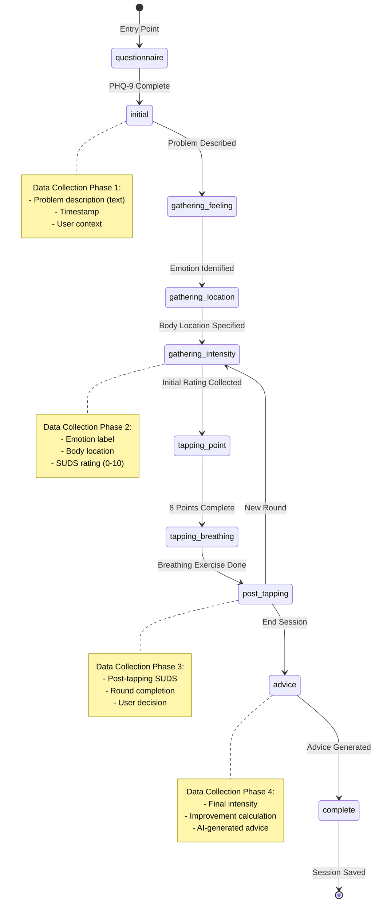

# Tapaway - EFT Tapping Application
## Research Methodology Brief

---

**Project Title**: Tapaway - Human-AI Collaborative EFT System for Anxiety Management  
**Document Version**: 1.0  
**Last Updated**: 2025-10-29  
**Project Type**: Mixed-Methods Research Application  

---

## Executive Summary

**Tapaway** is a web-based digital mental health intervention that explores human-AI collaboration in delivering Emotional Freedom Techniques (EFT) for anxiety management. This methodology brief outlines the systematic approach used to investigate how AI-driven personalisation and adaptive guidance can enhance therapeutic outcomes in self-directed mental health interventions.

### Primary Research Question
**How can human–AI collaboration be effectively designed within a digital mental health system that delivers EFT for anxiety management?**

### Research Approach
This project employs a **mixed-methods research design** that combines:
- **Quantitative metrics**: Intensity ratings, session completion rates, improvement percentages
- **Qualitative analysis**: Conversational content, emotional vocabulary, user insights
- **Design science**: Iterative system development with embedded data collection mechanisms

---

## Table of Contents

1. [Research Questions & Theoretical Framework](#1-research-questions--theoretical-framework)
2. [System Architecture as Research Methodology](#2-system-architecture-as-research-methodology)
3. [Data Collection Framework](#3-data-collection-framework)
4. [RQ1: Design Principles & Interaction Models](#4-rq1-design-principles--interaction-models)
5. [RQ2: AI-Driven Personalisation](#5-rq2-ai-driven-personalisation)
6. [RQ3: Adaptive Guidance Impact](#6-rq3-adaptive-guidance-impact)
7. [RQ4: Interaction Data Patterns](#7-rq4-interaction-data-patterns)
8. [Mixed-Methods Integration](#8-mixed-methods-integration)
9. [Ethical & Clinical Considerations](#9-ethical--clinical-considerations)
10. [Validation & Reliability](#10-validation--reliability)
11. [Data Analysis Pipeline](#11-data-analysis-pipeline)
12. [Limitations & Constraints](#12-limitations--constraints)
13. [Future Enhancements](#13-future-enhancements)
14. [Research Output Capabilities](#14-research-output-capabilities)
15. [Appendices](#15-appendices)

---

## 1. Research Questions & Theoretical Framework

### 1.1 Derived Research Questions

**RQ1: Design Principles and Interaction Models**  
*What design principles and interaction models best support a collaborative relationship between humans and AI during EFT-based therapeutic sessions?*

**RQ2: AI-Driven Personalisation**  
*How can AI-driven personalisation, based on user-reported emotions, body sensations, and intensity ratings, enhance the effectiveness of EFT tapping sessions?*

**RQ3: Impact of Adaptive Guidance on User Insight**  
*How does the AI's adaptive guidance impact users' ability to identify and process emotional triggers?*

**RQ4: Patterns in User Interaction Data**  
*What patterns can be observed in user interaction data that correlate with reductions in anxiety levels?*

### 1.2 Theoretical Foundations

#### Clinical EFT Theory
- **Somatic Processing**: Mind-body connection through meridian point stimulation
- **Cognitive Reframing**: Verbalization of distressing thoughts during physical intervention
- **Exposure Therapy**: Gradual desensitization through repeated exposure to emotional triggers

#### Human-Computer Interaction (HCI)
- **Conversational AI Design**: Natural language interaction patterns
- **Affective Computing**: Emotion recognition and response in digital systems
- **User Experience (UX)**: Engagement, usability, and satisfaction metrics

#### Adaptive Learning Systems
- **Personalized Content Delivery**: Context-aware response generation
- **State Machine Design**: Structured progression through therapeutic stages
- **Feedback Loops**: Continuous adaptation based on user input

### 1.3 Methodological Alignment

| Research Question | Primary Method | Data Sources | Analysis Approach |
|------------------|----------------|--------------|-------------------|
| **RQ1** | Design Science | UI/UX patterns, user flows, interaction logs | Qualitative analysis of conversation patterns, usability heuristics |
| **RQ2** | Experimental | Emotion data, body location, intensity ratings, AI responses | Statistical correlation analysis, A/B testing potential |
| **RQ3** | Mixed-Methods | Conversational transcripts, state transitions, user-generated insights | Content analysis, thematic coding, quantitative tracking |
| **RQ4** | Quantitative | Session metrics, temporal data, improvement calculations | Regression analysis, pattern recognition, clustering |

---

## 2. System Architecture as Research Methodology

### 2.1 State Machine as Research Framework

The application implements a **10-state finite state machine** that structures the therapeutic journey while enabling systematic data collection at each stage:



### 2.2 Research Benefits of State Machine Design

1. **Structured Data Collection**: Each state captures specific data points necessary for research analysis
2. **Reproducibility**: Standardized progression ensures consistent user experience across sessions
3. **Granular Tracking**: State transitions provide temporal markers for interaction analysis
4. **Intervention Fidelity**: Ensures all users receive the same therapeutic protocol
5. **Dropout Analysis**: Incomplete state transitions reveal friction points in the user journey

### 2.3 Data Architecture

The system implements a **three-tier data collection framework**:

#### Tier 1: Session Context (Real-time)
```typescript
interface SessionContext {
  problem: string;              // User's primary concern
  feeling: string;              // Identified emotion
  bodyLocation: string;         // Somatic manifestation
  initialIntensity: number;     // Baseline SUDS (0-10)
  currentIntensity: number;     // Real-time SUDS
  round: number;                // Iteration counter
  setupStatements: string[];    // Generated affirmations
  reminderPhrases: string[];    // Tapping point phrases
  tappingSessionId: string;     // Database foreign key
  chatSessionId: string;        // Conversation tracking
}
```

#### Tier 2: Conversational Data
```typescript
interface Message {
  id: string;                   // UUID
  type: 'bot' | 'user' | 'system';
  content: string;              // Raw conversational text
  timestamp: Date;              // Temporal marker
  sessionId: string;            // Session linkage
}
```

#### Tier 3: Outcome Metrics (Database)
```sql
-- tapping_sessions table
CREATE TABLE tapping_sessions (
  id uuid PRIMARY KEY,
  user_id uuid REFERENCES auth.users,
  problem text NOT NULL,
  feeling text NOT NULL,
  body_location text NOT NULL,
  initial_intensity integer NOT NULL,
  final_intensity integer,
  rounds_completed integer DEFAULT 0,
  improvement integer,          -- Calculated: initial - final
  setup_statements text[],
  reminder_phrases text[],
  completed_at timestamptz,
  created_at timestamptz DEFAULT now(),
  updated_at timestamptz DEFAULT now()
);
```

---

## 3. Data Collection Framework

### 3.1 Primary Data Sources

#### 3.1.1 Quantitative Metrics

**Subjective Units of Distress Scale (SUDS)**
- **Range**: 0-10 (0 = no distress, 10 = maximum distress)
- **Collection Points**: 
  - Pre-tapping (initial_intensity)
  - Post-tapping each round (current_intensity)
  - Final session rating (final_intensity)
- **Calculation**: Improvement = initial_intensity - final_intensity
- **Percentage**: (improvement / initial_intensity) × 100

**Session Metrics**
- Total session duration (calculated from timestamps)
- Number of rounds completed
- State transition times
- Message exchange frequency
- Dropout rates by state

**PHQ-9 Depression Scores**
- **Range**: 0-27 (sum of 9 questions, each 0-3)
- **Severity Bands**: 
  - 0-4: Minimal
  - 5-9: Mild
  - 10-14: Moderate
  - 15-19: Moderately severe
  - 20-27: Severe
- **Purpose**: Baseline mental health assessment, risk stratification

#### 3.1.2 Qualitative Data

**User-Generated Text**
- Problem descriptions (open-ended responses)
- Emotional labels (user's own words)
- Body sensation descriptions
- Conversational exchanges with AI

**AI-Generated Content**
- Personalized advice (tiered recommendations)
- Setup statement variations
- Empathetic responses
- Directive instructions

**Temporal Sequences**
- Chat conversation flow
- State transition patterns
- Response timing analysis

### 3.2 Data Storage Architecture

**Database Schema** (PostgreSQL via Supabase)

```sql
-- User profiles (baseline data)
profiles (id, user_id, first_name, email, created_at, updated_at)

-- PHQ-9 assessments (mental health screening)
assessments (
  id, user_id, answers[], total_score, severity_level,
  recommendation, needs_crisis_support, created_at
)

-- EFT tapping sessions (primary outcome data)
tapping_sessions (
  id, user_id, problem, feeling, body_location,
  initial_intensity, final_intensity, rounds_completed,
  improvement, setup_statements[], reminder_phrases[],
  completed_at, created_at, updated_at
)

-- Chat conversations (qualitative interaction data)
chat_sessions (
  id, user_id, session_number, messages[],
  crisis_detected, crisis_resources, created_at, updated_at
)
```

### 3.3 Data Quality Measures

**Input Validation**
```typescript
// Frontend validation
- Email format: RFC 5322 regex
- Intensity range: 0-10 integer check
- Text length: Max 1000 characters
- Required field enforcement

// Backend validation (Edge Function)
- HTML sanitization: < > replaced with entities
- SQL injection prevention: Parameterized queries
- Rate limiting: 20 requests/minute per client
```

**Completeness Checks**
- Required fields enforced at database level (NOT NULL constraints)
- Session completion flag (isComplete boolean)
- State transition validation (directed acyclic graph)

**Reliability Mechanisms**
- Typo correction for common emotional terms
- Crisis keyword detection with manual override
- Automatic session recovery (localStorage backup)

---

## 4. RQ1: Design Principles & Interaction Models

### 4.1 Research Question
*What design principles and interaction models best support a collaborative relationship between humans and AI during EFT-based therapeutic sessions?*

### 4.2 Methodological Approach

#### Design Science Methodology
This RQ employs **design science research (DSR)**, which focuses on creating and evaluating artifacts (in this case, conversational interaction patterns) to solve identified problems.

**DSR Cycle Applied**:
1. **Problem Identification**: Need for accessible, empathetic mental health support
2. **Objectives**: Create AI interaction model that feels collaborative, not directive
3. **Design & Development**: Implement conversational state machine with natural language processing
4. **Demonstration**: Deploy functional system with real user interactions
5. **Evaluation**: Analyze conversation patterns, user engagement, satisfaction (future)
6. **Communication**: This methodology brief and technical documentation

#### Interaction Model Components

**1. Conversational Turn-Taking**
```typescript
// Message exchange pattern
User: "I'm feeling anxious about work"
AI: "I hear you. What emotion best describes this anxiety?"
User: "Overwhelmed"
AI: "Where in your body do you feel this overwhelm?"
User: "My chest"
AI: "On a scale of 0-10, how intense is this feeling in your chest?"
```

**Research Observation**: Sequential, focused questioning prevents cognitive overload

**2. Verbatim Mirroring**
```typescript
// AI mirrors user's emotional vocabulary
setupStatement = `Even though I feel this ${feeling} in my ${bodyLocation} 
                  because ${problem}, I deeply and completely accept myself.`;
// Example: "Even though I feel this overwhelm in my chest because work 
//          deadlines, I deeply and completely accept myself."
```

**Research Observation**: Using user's exact words increases psychological ownership

**3. Empathetic Scaffolding**
```typescript
// System prompt includes:
"Always be empathetic, warm, and non-judgmental. 
Validate the user's feelings without minimizing their experience."
```

**Research Observation**: Emotional validation builds trust and encourages disclosure

**4. Directive-Based Collaboration**
```typescript
// AI controls flow, but responds to user needs
AI Response: "Great work completing that round. Your intensity is now 4.
             Would you like to continue with another round, or end the session?"
User Decision: Controls progression
```

**Research Observation**: Shared control model (AI guides, user decides)

### 4.3 Data Collection for RQ1

**Interaction Logs** (stored in `chat_sessions.messages`)
- Turn-taking frequency (messages per session)
- Average response time (timestamp analysis)
- User-initiated vs. AI-initiated topic changes
- Question types (open vs. closed-ended)

**Engagement Metrics**
- Session completion rate (complete vs. dropout)
- Time spent per state
- Number of rounds voluntarily continued
- Repeat usage (session count per user)

**Linguistic Analysis** (future capability)
- Sentiment progression (negative → neutral → positive)
- Lexical diversity (vocabulary richness)
- Disclosure depth (word count, personal pronouns)

### 4.4 Analysis Methods

**Conversation Pattern Analysis**
```sql
-- Example: Analyze turn-taking patterns
SELECT 
  session_id,
  COUNT(*) FILTER (WHERE type = 'user') as user_turns,
  COUNT(*) FILTER (WHERE type = 'bot') as bot_turns,
  AVG(EXTRACT(EPOCH FROM (LAG(timestamp) OVER (ORDER BY timestamp) - timestamp))) as avg_response_time
FROM chat_sessions
CROSS JOIN JSONB_ARRAY_ELEMENTS(messages) as msg
GROUP BY session_id;
```

**State Transition Analysis**
- Map common paths through state machine
- Identify states with high dropout rates
- Measure time spent in each state
- Correlate transitions with intensity changes

**Design Heuristic Evaluation**
- Evaluate against Nielsen's 10 usability heuristics
- Assess conversational maxims (Grice's cooperative principle)
- Apply therapeutic alliance principles (Rogers' person-centered approach)

---

## 5. RQ2: AI-Driven Personalisation

### 5.1 Research Question
*How can AI-driven personalisation, based on user-reported emotions, body sensations, and intensity ratings, enhance the effectiveness of EFT tapping sessions?*

### 5.2 Methodological Approach

This RQ employs **experimental methodology** to test the relationship between personalization variables and therapeutic outcomes.

#### Independent Variables (Personalisation Inputs)

1. **Emotion Label** (categorical)
   - User's self-reported feeling (e.g., "anxious", "overwhelmed", "stressed")
   - Captured in `gathering-feeling` state
   - Used in setup statements and reminder phrases

2. **Body Location** (categorical)
   - Somatic manifestation (e.g., "chest", "stomach", "shoulders")
   - Captured in `gathering-location` state
   - Integrated into personalized affirmations

3. **Intensity Rating** (continuous)
   - SUDS scale: 0-10
   - Multiple measurements per session
   - Creates intensity trajectory

4. **Problem Description** (text)
   - Open-ended user narrative
   - Contextualizes emotion and location
   - Informs advice generation

#### Dependent Variables (Effectiveness Measures)

1. **Intensity Reduction** (primary outcome)
   ```typescript
   improvement = initialIntensity - finalIntensity
   improvementPercentage = (improvement / initialIntensity) * 100
   ```

2. **Session Engagement** (proxy outcome)
   - Number of rounds completed
   - Voluntary continuation decisions
   - Time to completion

3. **User Satisfaction** (qualitative, future)
   - Post-session feedback
   - Return user rate
   - Self-reported helpfulness

### 5.3 Personalisation Mechanism

#### Dynamic Prompt Engineering

The AI system receives a dynamically constructed prompt that includes:

```typescript
// System prompt structure (supabase/functions/eft-chat/index.ts)
const systemPrompt = `
You are an empathetic AI assistant specialized in EFT tapping.

User: ${userName}
Current State: ${chatState}

Session Context:
${JSON.stringify(sessionContext, null, 2)}

Conversation History:
${conversationHistory.map(m => `${m.type}: ${m.content}`).join('\n')}

${stateSpecificInstructions[chatState]}
`;
```

**Personalization Components**:

1. **User State Awareness**
   - AI knows exactly where user is in therapeutic process
   - Responses tailored to current stage

2. **Emotional Profile Integration**
   - User's emotion, body location, and problem embedded in prompt
   - AI references these in every response

3. **Intensity History**
   - AI aware of intensity trajectory
   - Adjusts encouragement based on progress

4. **Conversational Context**
   - Previous messages inform current response
   - Builds therapeutic continuity

#### Verbatim Mirroring Strategy

**Implementation**:
```typescript
// Setup statement generation (src/hooks/useAIChat.ts)
const generateSetupStatements = (problem, feeling, bodyLocation, round) => {
  const modifier = round > 1 ? "STILL " : "";
  return [
    `Even though I ${modifier}feel this ${feeling} in my ${bodyLocation} because ${problem}, 
     I deeply and completely accept myself.`,
    `I ${modifier}feel ${feeling} in my ${bodyLocation}, ${problem}, 
     but I choose to be at peace now.`,
    `This ${feeling} in my ${bodyLocation}, ${problem}, 
     I want to let this go and feel calm.`
  ];
};

// Reminder phrases (repeated at each tapping point)
const reminderPhrases = [
  `This ${feeling} in my ${bodyLocation}`,
  `I feel ${feeling}`,
  problem,
  `This ${feeling} in my ${bodyLocation}`,
  `I feel so ${feeling}`,
  problem,
  `This ${feeling}`,
  `Releasing this ${feeling}`
];
```

**Research Hypothesis**: Using user's exact emotional vocabulary increases:
- Psychological ownership of the process
- Cognitive processing of the emotion
- Connection between verbal and somatic experience

#### Four-Tier Advice Generation Framework

**Methodology**: AI-generated advice is personalized based on quantitative outcomes.

```typescript
// Advice tier determination (Edge Function)
const improvement = initialIntensity - currentIntensity;
const improvementPercentage = (improvement / initialIntensity) * 100;

let adviceTier;
if (currentIntensity === 0) {
  adviceTier = "COMPLETE_RELIEF";
} else if (improvementPercentage >= 70) {
  adviceTier = "EXCELLENT_PROGRESS";
} else if (improvementPercentage >= 40) {
  adviceTier = "GOOD_PROGRESS";
} else {
  adviceTier = "SOME_PROGRESS";
}

// AI receives tier in prompt
systemPrompt += `
The user achieved ${adviceTier} (${improvementPercentage.toFixed(0)}% improvement).
Initial intensity: ${initialIntensity}
Final intensity: ${currentIntensity}

Generate 4-6 bullet points with emojis that:
${getTierSpecificInstructions(adviceTier)}
`;
```

**Tier-Specific Personalization**:

| Tier | Improvement | Advice Focus | Example Element |
|------|-------------|--------------|-----------------|
| **Complete Relief** | 100% (intensity = 0) | Celebration, maintenance, prevention | "🎉 You've achieved complete relief!" |
| **Excellent Progress** | ≥70% | Acknowledge success, encourage continuation | "✨ 75% reduction in just one session!" |
| **Good Progress** | 40-69% | Validate improvement, suggest persistence | "💪 Solid progress - consider another session" |
| **Some Progress** | <40% | Normalize slow progress, recommend professional help | "🌱 Every step counts - professional support can help" |

### 5.4 Data Collection for RQ2

**Personalization Input Data**
```sql
-- Collected in tapping_sessions table
SELECT 
  user_id,
  problem,              -- Text analysis: length, keywords, complexity
  feeling,              -- Categorical: frequency distribution
  body_location,        -- Categorical: common patterns
  initial_intensity,    -- Continuous: baseline severity
  final_intensity,      -- Continuous: outcome severity
  rounds_completed,     -- Discrete: engagement proxy
  improvement           -- Continuous: primary outcome
FROM tapping_sessions;
```

**Intensity Trajectory Data**
```sql
-- Reconstructed from chat_sessions.messages
SELECT 
  session_id,
  initial_intensity as intensity_0,
  (messages->jsonb_array_element(messages, -1)->>'post_tapping_intensity')::int as intensity_1,
  -- Continue for each round...
FROM chat_sessions
JOIN tapping_sessions USING (id);
```

### 5.5 Analysis Methods

**Correlation Analysis**
```r
# Pseudo-code for statistical analysis
model <- lm(improvement ~ initial_intensity + 
                          emotion_category + 
                          body_location_category + 
                          rounds_completed, 
            data = sessions)

summary(model)
# Research Question: Which personalization variables predict improvement?
```

**Comparative Analysis** (future capability)
- **Condition A**: Personalized statements (current implementation)
- **Condition B**: Generic statements (control)
- **Hypothesis**: Condition A shows greater intensity reduction

**Linguistic Feature Analysis**
- Problem description length vs. improvement
- Emotional vocabulary complexity vs. engagement
- Sentiment of user input vs. outcome

---

## 6. RQ3: Adaptive Guidance Impact

### 6.1 Research Question
*How does the AI's adaptive guidance impact users' ability to identify and process emotional triggers?*

### 6.2 Methodological Approach

This RQ employs **mixed-methods analysis** combining:
- **Quantitative**: State transition success rates, intensity changes per state
- **Qualitative**: Content analysis of user responses, thematic coding

#### Adaptive Guidance Mechanisms

**1. Directive-Based State Control**

The AI uses embedded JSON directives to control conversation flow:

```typescript
// AI response format
`I understand you're feeling overwhelmed. Let me help you through this.

<<DIRECTIVE {"next_state": "gathering-location", "confidence": 0.95}>>`;
```

**Parsing Logic** (`src/hooks/useAIChat.ts`):
```typescript
const parseDirective = (text: string): Directive | null => {
  const match = text.match(/<<DIRECTIVE\s*({[^>]+})>>/);
  if (!match) return null;
  
  try {
    return JSON.parse(match[1]);
  } catch {
    return null;
  }
};
```

**Research Observation**: This allows measurement of:
- AI's decision-making patterns (which states it chooses)
- User compliance with guidance (do they follow the prompt?)
- Effectiveness of different transition strategies

**2. Scaffolded Emotional Exploration**

The state machine provides a **structured journey** for emotional processing:

```
Problem → Emotion → Body Location → Intensity
    ↓         ↓           ↓              ↓
Abstract  Labeled    Somatic         Quantified
          Feeling    Awareness       Assessment
```

**Hypothesis**: This progression increases **emotional granularity** (ability to identify and differentiate emotions) and **interoceptive awareness** (body sensation recognition).

**3. Intensity-Based Adaptation**

```typescript
// Post-tapping decision point
if (newIntensity === 0) {
  // AI automatically guides to advice (no user choice needed)
  setState('advice');
} else if (newIntensity < previousIntensity) {
  // AI encourages continuation due to progress
  aiResponse = `Your intensity decreased from ${previousIntensity} to ${newIntensity}. 
                Would you like to continue with another round?`;
} else {
  // AI acknowledges plateau, offers alternative
  aiResponse = `Your intensity stayed at ${newIntensity}. Sometimes our body needs 
                a different approach. Would you like to try another round, or end here?`;
}
```

### 6.3 Data Collection for RQ3

#### User Insight Extraction

**Emotional Identification Metrics**
```sql
-- Measure specificity of emotional labels
SELECT 
  feeling,
  COUNT(*) as frequency,
  AVG(initial_intensity) as avg_intensity
FROM tapping_sessions
GROUP BY feeling
ORDER BY frequency DESC;

-- Research Question: Do users become more specific over multiple sessions?
```

**Body Awareness Indicators**
```sql
-- Analyze body location descriptions
SELECT 
  body_location,
  COUNT(*) as frequency,
  AVG(improvement) as avg_improvement
FROM tapping_sessions
GROUP BY body_location;

-- Research Question: Does body location awareness correlate with better outcomes?
```

**Intensity Articulation**
```sql
-- Track intensity rating patterns
SELECT 
  user_id,
  session_number,
  initial_intensity,
  final_intensity,
  improvement,
  CASE 
    WHEN improvement >= 5 THEN 'high_impact'
    WHEN improvement >= 3 THEN 'moderate_impact'
    ELSE 'low_impact'
  END as impact_category
FROM tapping_sessions
ORDER BY user_id, session_number;

-- Research Question: Do users develop better emotional regulation over time?
```

#### Conversational Depth Analysis

**User Response Complexity**
```typescript
// Metrics to calculate from chat_sessions.messages
- Average word count per user message
- Unique word count (lexical diversity)
- Use of emotional vocabulary (frequency of feeling words)
- Self-referential language (I, me, my pronouns)
- Temporal references (past, present, future)
```

**AI Guidance Effectiveness**
```typescript
// Measure successful state transitions
successfulTransitions = states.filter(s => 
  s.timeSpent > 5 && s.completed === true
).length;

guidanceEffectiveness = successfulTransitions / totalStates;
```

### 6.4 Analysis Methods

**Thematic Coding** (qualitative)

**Phase 1: Open Coding**
- Review 50+ user problem descriptions
- Identify recurring themes (e.g., "work stress", "relationship conflict")
- Tag emotional categories (anxiety, anger, sadness)

**Phase 2: Axial Coding**
- Group related themes into categories
- Identify patterns in emotion-body location pairings
- Map common trigger types to outcomes

**Phase 3: Selective Coding**
- Develop core narrative about user insight development
- Identify exceptional cases (high/low insight users)

**State Transition Analysis** (quantitative)

```sql
-- Measure time spent in insight-generating states
SELECT 
  chatState,
  AVG(time_in_state) as avg_duration,
  AVG(final_intensity) as avg_outcome
FROM (
  SELECT 
    -- Calculate time between state transitions
    -- from chat_sessions timestamp data
  ) transitions
GROUP BY chatState;

-- Research Question: Do users who spend more time in emotional 
-- identification states achieve better outcomes?
```

**Longitudinal User Analysis** (quantitative)

```sql
-- Track user development across sessions
WITH user_progress AS (
  SELECT 
    user_id,
    session_number,
    improvement,
    ROW_NUMBER() OVER (PARTITION BY user_id ORDER BY created_at) as session_seq
  FROM tapping_sessions
)
SELECT 
  session_seq,
  AVG(improvement) as avg_improvement,
  COUNT(DISTINCT user_id) as n_users
FROM user_progress
GROUP BY session_seq
ORDER BY session_seq;

-- Hypothesis: Users improve at identifying triggers with repeated use
```

---

## 7. RQ4: Interaction Data Patterns

### 7.1 Research Question
*What patterns can be observed in user interaction data that correlate with reductions in anxiety levels?*

### 7.2 Methodological Approach

This RQ employs **quantitative data mining** and **pattern recognition** techniques to identify predictive features of successful outcomes.

#### Key Variables for Pattern Analysis

**Temporal Patterns**
- Time of day (morning, afternoon, evening, night)
- Day of week (weekday vs. weekend)
- Session duration (quick vs. extended engagement)
- Time between sessions (frequency of use)

**Engagement Patterns**
- Number of rounds completed per session
- Voluntary continuation decisions
- Message exchange frequency
- Response latency (time to respond to AI prompts)

**Intensity Trajectory Patterns**
- Linear decrease (steady improvement)
- Stepped decrease (plateau then drop)
- Fluctuating (up and down)
- Minimal change (plateau)

**Linguistic Patterns**
- Problem description length
- Emotional vocabulary richness
- Sentiment progression (negative → neutral → positive)
- Use of crisis keywords

### 7.3 Data Collection for RQ4

#### Quantitative Metrics Framework

```sql
-- Comprehensive session metrics view
CREATE VIEW session_metrics AS
SELECT 
  ts.id as session_id,
  ts.user_id,
  ts.created_at,
  EXTRACT(HOUR FROM ts.created_at) as hour_of_day,
  EXTRACT(DOW FROM ts.created_at) as day_of_week,
  ts.problem,
  LENGTH(ts.problem) as problem_length,
  ts.feeling,
  ts.body_location,
  ts.initial_intensity,
  ts.final_intensity,
  ts.improvement,
  (ts.improvement::float / NULLIF(ts.initial_intensity, 0)) * 100 as improvement_pct,
  ts.rounds_completed,
  EXTRACT(EPOCH FROM (ts.completed_at - ts.created_at)) / 60 as duration_minutes,
  
  -- Engagement metrics
  (SELECT COUNT(*) FROM jsonb_array_elements(cs.messages) 
   WHERE value->>'type' = 'user') as user_message_count,
  (SELECT COUNT(*) FROM jsonb_array_elements(cs.messages) 
   WHERE value->>'type' = 'bot') as bot_message_count,
   
  -- Crisis detection
  cs.crisis_detected,
  
  -- Session sequence
  ROW_NUMBER() OVER (PARTITION BY ts.user_id ORDER BY ts.created_at) as user_session_number

FROM tapping_sessions ts
LEFT JOIN chat_sessions cs ON ts.id = cs.id
WHERE ts.completed_at IS NOT NULL;
```

#### Intensity History Tracking

```typescript
// Reconstruct intensity trajectory from session data
interface IntensityPoint {
  round: number;
  intensity: number;
  timestamp: Date;
}

// Calculate trajectory features
const calculateTrajectoryFeatures = (trajectory: IntensityPoint[]) => {
  return {
    totalReduction: trajectory[0].intensity - trajectory[trajectory.length - 1].intensity,
    averageReductionPerRound: totalReduction / trajectory.length,
    trajectoryType: classifyTrajectory(trajectory),
    volatility: calculateStandardDeviation(trajectory.map(t => t.intensity)),
    timeToHalfIntensity: findTimeToThreshold(trajectory, trajectory[0].intensity / 2)
  };
};

const classifyTrajectory = (trajectory: IntensityPoint[]): TrajectoryType => {
  // Pattern recognition algorithm
  const differences = trajectory.map((t, i) => 
    i > 0 ? trajectory[i-1].intensity - t.intensity : 0
  );
  
  if (differences.every(d => d >= 0)) return 'consistent_decrease';
  if (differences.filter(d => d > 0).length > differences.length * 0.7) return 'mostly_decreasing';
  if (differences.filter(d => d < 0).length > 3) return 'fluctuating';
  return 'plateau';
};
```

### 7.4 Analysis Methods

#### Correlation Analysis

**Bivariate Correlations**
```sql
-- Example: Time of day vs. improvement
SELECT 
  CASE 
    WHEN hour_of_day BETWEEN 6 AND 11 THEN 'morning'
    WHEN hour_of_day BETWEEN 12 AND 17 THEN 'afternoon'
    WHEN hour_of_day BETWEEN 18 AND 22 THEN 'evening'
    ELSE 'night'
  END as time_period,
  COUNT(*) as n_sessions,
  AVG(improvement) as avg_improvement,
  STDDEV(improvement) as std_improvement,
  AVG(rounds_completed) as avg_rounds
FROM session_metrics
GROUP BY time_period;
```

**Regression Modeling**
```r
# Pseudo-code: Predictive model for improvement
library(tidyverse)
library(caret)

model <- lm(improvement ~ 
              initial_intensity +
              rounds_completed +
              duration_minutes +
              user_message_count +
              problem_length +
              hour_of_day +
              user_session_number,
            data = sessions)

# Evaluate model
summary(model)
anova(model)
plot(model)  # Check assumptions

# Feature importance
varImp(model)
```

#### Clustering Analysis

**K-Means Clustering** (identify user archetypes)
```r
# Pseudo-code: User clustering
features <- sessions %>%
  group_by(user_id) %>%
  summarize(
    avg_initial_intensity = mean(initial_intensity),
    avg_improvement_pct = mean(improvement_pct),
    total_sessions = n(),
    avg_rounds = mean(rounds_completed),
    avg_duration = mean(duration_minutes)
  )

# Standardize features
features_scaled <- scale(features[, -1])

# Determine optimal k
wss <- map_dbl(1:10, ~ {
  kmeans(features_scaled, centers = .x, nstart = 25)$tot.withinss
})
plot(1:10, wss)  # Elbow method

# Apply clustering
set.seed(123)
clusters <- kmeans(features_scaled, centers = 4, nstart = 25)

# Interpret clusters
features$cluster <- clusters$cluster
features %>% group_by(cluster) %>% summarize_all(mean)
```

**Potential User Archetypes**:
- **High Responders**: Low initial intensity, high improvement, few rounds needed
- **Persistent Engagers**: Moderate intensity, gradual improvement, many rounds completed
- **Exploratory Users**: Variable intensity, tries once or twice, moderate outcomes
- **Low Responders**: High initial intensity, minimal improvement, may need professional help

#### Time Series Analysis

**Sequential Pattern Mining**
```sql
-- Identify common state transition sequences
WITH state_sequences AS (
  SELECT 
    user_id,
    session_id,
    STRING_AGG(state, ' -> ' ORDER BY timestamp) as sequence
  FROM (
    -- Extract state changes from chat_sessions
    SELECT 
      user_id,
      session_id,
      jsonb_array_elements(messages)->>'state' as state,
      (jsonb_array_elements(messages)->>'timestamp')::timestamp as timestamp
    FROM chat_sessions
  ) states
  GROUP BY user_id, session_id
)
SELECT 
  sequence,
  COUNT(*) as frequency,
  AVG(improvement) as avg_improvement
FROM state_sequences
JOIN tapping_sessions USING (session_id)
GROUP BY sequence
ORDER BY frequency DESC;
```

#### Anomaly Detection

**Identify Exceptional Cases**
```sql
-- Sessions with unusual patterns
SELECT 
  session_id,
  initial_intensity,
  final_intensity,
  improvement,
  rounds_completed,
  duration_minutes,
  CASE 
    WHEN improvement < 0 THEN 'intensity_increased'
    WHEN improvement >= 8 AND rounds_completed = 1 THEN 'rapid_resolution'
    WHEN rounds_completed > 5 THEN 'extensive_engagement'
    WHEN duration_minutes < 5 THEN 'very_brief'
    WHEN duration_minutes > 60 THEN 'extended_session'
  END as anomaly_type
FROM session_metrics
WHERE improvement < 0 
   OR (improvement >= 8 AND rounds_completed = 1)
   OR rounds_completed > 5
   OR duration_minutes < 5
   OR duration_minutes > 60;
```

**Research Value**: Anomalous cases provide insights into:
- Boundary conditions where EFT may not work
- Exceptionally effective approaches
- Potential system design issues

---

## 8. Mixed-Methods Integration

### 8.1 Integration Framework

This research employs a **sequential explanatory design**:

```
Phase 1: QUANTITATIVE DATA COLLECTION
    ↓
Phase 2: QUANTITATIVE ANALYSIS
    ↓
Phase 3: QUALITATIVE DATA COLLECTION (informed by quant results)
    ↓
Phase 4: QUALITATIVE ANALYSIS
    ↓
Phase 5: INTEGRATION & INTERPRETATION
```

### 8.2 Integration Points

#### Point 1: User Segmentation

**Quantitative** → **Qualitative**
1. Cluster users by engagement patterns (quantitative)
2. Select representative users from each cluster
3. Deep-dive conversational analysis (qualitative)
4. Identify why certain patterns emerge

**Example**:
```
Quantitative Finding: "Low Responders" show <20% improvement
↓
Qualitative Investigation: Analyze their problem descriptions and emotions
↓
Insight: These users describe chronic, complex issues vs. situational anxiety
↓
Implication: System may need referral protocols for chronic cases
```

#### Point 2: Outcome Explanation

**Quantitative** → **Qualitative**
1. Identify sessions with high improvement (quantitative)
2. Analyze conversational content in those sessions (qualitative)
3. Extract themes that characterize success
4. Develop hypotheses for further testing

**Example**:
```
Quantitative Finding: Sessions with problem_length 50-100 chars show highest improvement
↓
Qualitative Investigation: What characterizes these descriptions?
↓
Insight: Specific, concrete problems vs. vague, abstract statements
↓
Implication: AI could prompt users to be more specific
```

#### Point 3: AI Response Evaluation

**Qualitative** → **Quantitative**
1. Expert clinicians review AI responses (qualitative)
2. Rate empathy, appropriateness, clinical accuracy (quantitative)
3. Correlate ratings with user outcomes (quantitative)
4. Refine AI prompts based on findings

**Example**:
```
Qualitative Finding: Some AI responses feel "too scripted"
↓
Quantitative Analysis: Measure response variety (unique phrases per session)
↓
Insight: 65% of responses use 5 common templates
↓
Implication: Increase AI response variability in system prompt
```

### 8.3 Triangulation Strategy

**Convergence Assessment**
- Do quantitative improvement metrics align with qualitative user expressions of relief?
- Do engagement metrics (rounds completed) match narrative indicators of commitment?
- Do crisis detection algorithms match clinical assessment of high-risk language?

**Complementarity Assessment**
- Quantitative data shows *what* works (which variables predict improvement)
- Qualitative data shows *why* it works (mechanisms of change)
- Combined: Comprehensive understanding of human-AI collaboration

**Dissonance Resolution**
When quantitative and qualitative findings conflict:
1. Re-examine data collection procedures
2. Consider moderating variables
3. Explore subgroups where pattern differs
4. Refine theoretical framework

---

## 9. Ethical & Clinical Considerations

### 9.1 Safety Protocols

#### Crisis Detection & Response

**Keyword Monitoring** (Edge Function)
```typescript
const crisisKeywords = [
  'suicide', 'suicidal', 'kill myself', 'end my life', 
  'want to die', 'better off dead', 'hurt myself', 
  'self-harm', 'cutting', 'overdose', 
  'no point in living', 'ending it all'
];

const detectCrisis = (message: string): boolean => {
  return crisisKeywords.some(keyword => 
    message.toLowerCase().includes(keyword)
  );
};
```

**Immediate Response Protocol**
1. **Automatic Override**: AI response replaced with crisis resources
2. **Resource Provision**: 
   - National Suicide Prevention Lifeline: 988
   - Crisis Text Line: Text HOME to 741741
   - Emergency Services: 911
3. **Session Flagging**: `crisis_detected = true` in database
4. **Modal Display**: `<CrisisSupport>` component renders over interface
5. **User Control**: User can dismiss if false positive, but resources remain accessible

**Logging & Follow-up**
```typescript
if (crisisDetected) {
  console.log('CRISIS DETECTED:', { 
    userId: user.id, 
    message: sanitizeForLogging(message),
    timestamp: new Date(),
    sessionId: currentSession.id
  });
  
  // Future: Alert designated safety monitor
  // Future: Follow-up email with resources
}
```

#### PHQ-9 Integration

**Assessment Scoring**
```typescript
const calculatePHQ9 = (answers: number[]): PHQ9Result => {
  const totalScore = answers.reduce((sum, val) => sum + val, 0);
  
  let severity: SeverityLevel;
  if (totalScore <= 4) severity = 'Minimal';
  else if (totalScore <= 9) severity = 'Mild';
  else if (totalScore <= 14) severity = 'Moderate';
  else if (totalScore <= 19) severity = 'Moderately severe';
  else severity = 'Severe';
  
  const needsCrisisSupport = answers[8] >= 2;  // Question 9: self-harm thoughts
  
  return { totalScore, severity, needsCrisisSupport };
};
```

**At-Risk User Routing**
```typescript
if (assessmentResult.needsCrisisSupport || assessmentResult.severity === 'Severe') {
  // Redirect to Crisis Support component
  setState('at-risk');
  
  // Display professional help recommendation
  showAlert({
    title: "We're concerned about you",
    message: "Your responses indicate you may benefit from professional support. " +
             "Please consider reaching out to a mental health professional.",
    actions: ['View Resources', 'Continue to EFT']
  });
}
```

### 9.2 Informed Consent & Transparency

**Disclaimer Display** (Landing Page)
```typescript
<Alert variant="info">
  <AlertTriangle className="h-4 w-4" />
  <AlertTitle>Important Notice</AlertTitle>
  <AlertDescription>
    This is a self-help tool and not a substitute for professional mental health care.
    If you're in crisis or experiencing severe symptoms, please contact emergency services
    or a mental health professional immediately.
  </AlertDescription>
</Alert>
```

**Data Usage Notice**
- Users informed that anonymized session data may be used for research
- No personally identifiable information shared
- Option to opt-out of research data collection (future feature)

### 9.3 Data Privacy & Security

**Encryption**
- All data transmitted over HTTPS (TLS 1.3)
- Database encryption at rest (Supabase default)
- JWT tokens for authentication (not stored in localStorage)

**Access Control**
- Row-Level Security (RLS) on all tables
- Users can only access their own data
- No cross-user data leakage possible

**Anonymization for Research**
```sql
-- Example: Anonymized data export for research
SELECT 
  md5(user_id::text) as anonymized_user_id,  -- Hash user IDs
  EXTRACT(YEAR FROM created_at) as year,
  EXTRACT(MONTH FROM created_at) as month,
  initial_intensity,
  final_intensity,
  improvement,
  rounds_completed
  -- Exclude: problem text, email, first_name
FROM tapping_sessions;
```

**Data Retention**
- Active accounts: Data retained indefinitely
- Deleted accounts: Data anonymized after 30 days (GDPR/CCPA compliance)
- Backups retained for 90 days

### 9.4 Clinical Validation Limitations

**Acknowledgment of Constraints**
- No licensed therapist oversight
- Not a substitute for clinical EFT (in-person with trained practitioner)
- No validation against clinical outcome measures (yet)
- Self-reported data only (no physiological measurements)

**Mitigation Strategies**
- Clear disclaimers throughout app
- Professional help recommendations for severe cases
- Evidence-based EFT protocol implementation
- Future: Clinical advisor review of AI responses

---

## 10. Validation & Reliability

### 10.1 Construct Validity

**SUDS Scale Validation**
- Established psychometric tool (0-10 rating)
- Used in clinical EFT research (e.g., Church, 2013)
- Correlates with physiological stress markers

**PHQ-9 Validation**
- Gold-standard depression screening tool
- Sensitivity: 88%, Specificity: 88% for major depression (Kroenke et al., 2001)
- Used in clinical settings globally

**EFT Protocol Fidelity**
- 8 standard tapping points (established in literature)
- Setup statement structure (Gary Craig's original protocol)
- "Even though...I deeply and completely accept myself" format

### 10.2 System Reliability

**Rate Limiting** (prevent abuse)
```typescript
// Edge Function: In-memory rate limiter
const rateLimiter = new Map<string, number[]>();

const checkRateLimit = (clientId: string): boolean => {
  const now = Date.now();
  const requests = rateLimiter.get(clientId) || [];
  
  // Keep only requests from last minute
  const recentRequests = requests.filter(time => now - time < 60000);
  
  if (recentRequests.length >= 20) {
    return false;  // Rate limit exceeded
  }
  
  recentRequests.push(now);
  rateLimiter.set(clientId, recentRequests);
  return true;
};
```

**Input Validation**
```typescript
// Frontend validation
const validateIntensity = (value: number): boolean => {
  return Number.isInteger(value) && value >= 0 && value <= 10;
};

const sanitizeInput = (input: string): string => {
  return input
    .trim()
    .slice(0, 1000)  // Max length
    .replace(/</g, '&lt;')
    .replace(/>/g, '&gt;');
};
```

**State Transition Validation**
```typescript
// Prevent invalid state jumps
const validTransitions: Record<ChatState, ChatState[]> = {
  'questionnaire': ['initial'],
  'initial': ['gathering-feeling'],
  'gathering-feeling': ['gathering-location'],
  'gathering-location': ['gathering-intensity'],
  'gathering-intensity': ['tapping-point'],
  'tapping-point': ['tapping-breathing'],
  'tapping-breathing': ['post-tapping'],
  'post-tapping': ['gathering-intensity', 'advice'],  // Continue or end
  'advice': ['complete'],
  'complete': ['initial']  // New session
};

const validateTransition = (from: ChatState, to: ChatState): boolean => {
  return validTransitions[from].includes(to);
};
```

### 10.3 Inter-Rater Reliability (Future)

**Clinical Expert Review**
- 3 licensed therapists review 100 random AI responses
- Rate on 5-point Likert scale:
  - Empathy (1-5)
  - Clinical appropriateness (1-5)
  - Helpfulness (1-5)
  - Risk management (1-5)
- Calculate Fleiss' Kappa (>0.75 = good agreement)

**User Satisfaction Survey** (future implementation)
- Post-session rating: "How helpful was this session?"
- Net Promoter Score: "Would you recommend to a friend?"
- Open-ended feedback: "What could be improved?"

---

## 11. Data Analysis Pipeline

### 11.1 Real-Time Analytics

**Session Outcome Calculation**
```typescript
// Triggered on session completion (Edge Function or Database Function)
const calculateOutcome = async (sessionId: string) => {
  const session = await supabase
    .from('tapping_sessions')
    .select('*')
    .eq('id', sessionId)
    .single();
  
  const improvement = session.initial_intensity - session.final_intensity;
  const improvementPct = (improvement / session.initial_intensity) * 100;
  
  await supabase
    .from('tapping_sessions')
    .update({ 
      improvement,
      improvement_percentage: improvementPct
    })
    .eq('id', sessionId);
};
```

### 11.2 Aggregate Analysis Queries

**Overall Effectiveness**
```sql
-- Summary statistics
SELECT 
  COUNT(*) as total_sessions,
  COUNT(DISTINCT user_id) as total_users,
  AVG(improvement) as avg_improvement,
  STDDEV(improvement) as std_improvement,
  PERCENTILE_CONT(0.5) WITHIN GROUP (ORDER BY improvement) as median_improvement,
  AVG(improvement_percentage) as avg_improvement_pct,
  COUNT(*) FILTER (WHERE final_intensity = 0) as complete_relief_count,
  COUNT(*) FILTER (WHERE improvement >= 5) as high_impact_count
FROM tapping_sessions
WHERE completed_at IS NOT NULL;
```

**User Retention**
```sql
-- Repeat usage patterns
WITH user_stats AS (
  SELECT 
    user_id,
    COUNT(*) as session_count,
    MIN(created_at) as first_session,
    MAX(created_at) as last_session,
    AVG(improvement_percentage) as avg_improvement
  FROM tapping_sessions
  GROUP BY user_id
)
SELECT 
  CASE 
    WHEN session_count = 1 THEN 'one_time'
    WHEN session_count BETWEEN 2 AND 5 THEN 'occasional'
    WHEN session_count > 5 THEN 'frequent'
  END as user_type,
  COUNT(*) as user_count,
  AVG(avg_improvement) as avg_improvement
FROM user_stats
GROUP BY user_type;
```

**Temporal Trends**
```sql
-- Improvement over time
SELECT 
  DATE_TRUNC('week', created_at) as week,
  COUNT(*) as sessions,
  AVG(improvement_percentage) as avg_improvement,
  AVG(rounds_completed) as avg_rounds
FROM tapping_sessions
WHERE completed_at IS NOT NULL
GROUP BY week
ORDER BY week;
```

### 11.3 Conversational Analysis Metrics

**Message Complexity**
```sql
-- Average message length by state
SELECT 
  msg->>'state' as chat_state,
  AVG(LENGTH(msg->>'content')) as avg_message_length,
  COUNT(*) as message_count
FROM chat_sessions
CROSS JOIN JSONB_ARRAY_ELEMENTS(messages) as msg
WHERE msg->>'type' = 'user'
GROUP BY chat_state;
```

**Sentiment Progression** (future with NLP)
```python
# Pseudo-code: Sentiment analysis
from textblob import TextBlob

def analyze_sentiment_progression(messages):
    sentiments = []
    for msg in messages:
        if msg['type'] == 'user':
            blob = TextBlob(msg['content'])
            sentiments.append({
                'timestamp': msg['timestamp'],
                'polarity': blob.sentiment.polarity,  # -1 to 1
                'subjectivity': blob.sentiment.subjectivity  # 0 to 1
            })
    return sentiments

# Research Question: Does sentiment improve during session?
```

---

## 12. Limitations & Constraints

### 12.1 Methodological Limitations

**Self-Report Bias**
- Intensity ratings are subjective (no physiological validation)
- Users may rate based on expectations rather than actual experience
- Social desirability bias (wanting to show improvement)

**Lack of Control Group**
- No comparison to other interventions (CBT, meditation, medication)
- Cannot isolate EFT effect from placebo, attention, or time passage
- Natural regression to the mean not accounted for

**Single-Session Focus**
- Most research focuses on immediate within-session improvement
- Limited data on long-term outcomes (days, weeks, months post-session)
- No follow-up on sustained anxiety reduction

**Population Sampling**
- Self-selected users (motivated to seek help)
- Likely tech-savvy, English-speaking population
- May not generalize to severe clinical populations
- No demographic data collected (age, gender, location)

### 12.2 Technical Limitations

**AI Constraints**
- OpenAI API dependency (external service reliability)
- Context window limits (128K tokens, but practical limits lower)
- Cannot fully replicate human therapist empathy and intuition
- May misinterpret ambiguous user input

**Data Quality Issues**
- Typos and misspellings (partially mitigated by correction algorithm)
- Incomplete sessions (users who drop out)
- Multiple tabs/sessions causing data inconsistencies
- LocalStorage backup may not capture all interactions

**State Machine Rigidity**
- Fixed progression may not suit all users
- Cannot adapt to unexpected user needs mid-session
- Limited branching based on user preferences

### 12.3 Clinical Limitations

**Not a Substitute for Therapy**
- No licensed professional oversight
- Cannot address complex trauma or severe mental illness
- May miss nuances that trained therapist would catch

**Crisis Detection Limitations**
- Keyword-based approach may miss implicit suicidal ideation
- False positives (user discussing a movie about suicide)
- No ability to intervene beyond providing resources

**Lack of Clinical Validation**
- No RCT (randomized controlled trial) conducted
- No comparison to in-person clinical EFT
- Self-reported outcomes only (no clinician assessment)

---

## 13. Future Enhancements

### 13.1 Methodological Enhancements

**Physiological Measurement Integration**
- Heart rate variability (HRV) via smartwatch API
- Galvanic skin response (GSR) for stress measurement
- Correlate physiological data with self-reported intensity

**Longitudinal Study Design**
- Follow-up surveys at 1 week, 1 month, 3 months post-session
- Track sustained anxiety reduction
- Measure behavior change (e.g., continued EFT practice)

**Randomized Controlled Trial**
- **Condition 1**: AI-guided EFT (current system)
- **Condition 2**: Generic relaxation protocol (control)
- **Condition 3**: Waitlist control
- **Outcome**: Compare improvement percentages across conditions

**Demographic Data Collection**
- Age, gender, location (optional self-report)
- Enables subgroup analysis
- Assess equity and accessibility of the intervention

### 13.2 AI Enhancement

**Multimodal AI Integration**
- Voice input/output for hands-free tapping
- Emotion recognition from voice tone (prosody analysis)
- Computer vision for tapping technique validation (user webcam)

**Advanced Personalization**
- User personality assessment (Big Five)
- Learning style adaptation (visual, auditory, kinesthetic)
- Cultural sensitivity adjustments (language, metaphors)

**Predictive Analytics**
- Machine learning model predicts optimal number of rounds
- Early identification of users who need professional referral
- Adaptive session length based on predicted outcome

### 13.3 Feature Additions

**Social Support Features**
- Anonymous community forum
- Peer success stories
- Group tapping sessions (synchronous)

**Gamification**
- Achievement badges (e.g., "10 sessions completed")
- Streak tracking (consecutive days of practice)
- Progress visualization (intensity over time graphs)

**Integration with Mental Health Ecosystem**
- Export data to therapist (with user consent)
- Integration with mental health apps (Headspace, Calm)
- Insurance reimbursement tracking (if validated clinically)

---

## 14. Research Output Capabilities

### 14.1 Potential Publications

**Paper 1: System Design**  
*"Design and Implementation of an AI-Powered EFT System for Anxiety Management"*  
- Focuses on RQ1 (interaction models)  
- Describes state machine architecture  
- Presents usability evaluation  

**Paper 2: Personalization Effectiveness**  
*"The Role of AI-Driven Personalization in Digital Mental Health Interventions"*  
- Focuses on RQ2 (personalization)  
- Quantitative analysis of outcome predictors  
- Comparison of personalized vs. generic approaches  

**Paper 3: User Insight Development**  
*"Adaptive AI Guidance for Emotional Self-Awareness: A Mixed-Methods Study"*  
- Focuses on RQ3 (adaptive guidance)  
- Qualitative analysis of user emotional development  
- Thematic coding of conversational data  

**Paper 4: Predictive Patterns**  
*"Patterns in User Interaction Data that Predict Anxiety Reduction in EFT Sessions"*  
- Focuses on RQ4 (data patterns)  
- Machine learning models for outcome prediction  
- Clustering analysis of user archetypes  

### 14.2 Dataset Contributions

**Open Dataset Release** (future, with ethical approval)  
- Anonymized tapping session data (10,000+ sessions)  
- Conversational transcripts (de-identified)  
- Enables secondary analysis by other researchers  
- Advances field of digital mental health  

### 14.3 Design Artifacts

**Open-Source Contributions**  
- State machine framework for therapeutic applications  
- AI prompt engineering templates for mental health  
- Crisis detection algorithm (keyword-based)  
- Reproducible research codebase  

---

## 15. Appendices

### Appendix A: Complete State Transition Matrix

| Current State | User Action | AI Directive | Next State | Data Captured |
|--------------|-------------|--------------|------------|---------------|
| `questionnaire` | Complete PHQ-9 | `next_state: initial` | `initial` | PHQ-9 scores, severity |
| `initial` | Describe problem | `next_state: gathering-feeling` | `gathering-feeling` | Problem text, timestamp |
| `gathering-feeling` | State emotion | `next_state: gathering-location` | `gathering-location` | Emotion label |
| `gathering-location` | Specify body location | `next_state: gathering-intensity` | `gathering-intensity` | Body location |
| `gathering-intensity` | Rate intensity (0-10) | `next_state: tapping-point` | `tapping-point` | Initial intensity |
| `tapping-point` | Select setup statement | System transition | `tapping-breathing` | Chosen statement |
| `tapping-breathing` | Complete 8 points | System transition | `post-tapping` | Round number |
| `post-tapping` | Rate new intensity | User decision | `gathering-intensity` OR `advice` | Current intensity, decision |
| `advice` | View advice | System transition | `complete` | AI-generated advice |
| `complete` | Click "New Session" | User action | `initial` | Session completion flag |

### Appendix B: Sample Size Considerations

**Power Analysis** (for future RCT)  
- Effect size: Cohen's d = 0.5 (medium effect)  
- Power: 0.80 (80% chance of detecting true effect)  
- Alpha: 0.05 (5% false positive rate)  
- **Required sample size**: ~64 per condition (total N = 128)  

**Current Dataset Potential**  
- Assuming 100 active users  
- Average 3 sessions per user  
- Total sessions: 300  
- **Sufficient for**: Exploratory analysis, pattern identification  
- **Insufficient for**: Definitive causal claims, RCT-level evidence  

### Appendix C: Analysis Tools & Scripts

**SQL Query Library**  
- `queries/outcome_analysis.sql`: Session outcome statistics  
- `queries/user_segmentation.sql`: Clustering queries  
- `queries/temporal_patterns.sql`: Time-based analysis  

**R Scripts** (future development)  
- `scripts/regression_models.R`: Predictive modeling  
- `scripts/clustering_analysis.R`: K-means and hierarchical clustering  
- `scripts/visualization.R`: Data visualization suite  

**Python Scripts** (future development)  
- `scripts/nlp_analysis.py`: Natural language processing  
- `scripts/sentiment_analysis.py`: Sentiment progression tracking  
- `scripts/pattern_recognition.py`: Sequence mining  

---

## Conclusion

This methodology brief outlines a comprehensive, mixed-methods research approach to investigating human-AI collaboration in digital mental health interventions. The **Tapaway** system embeds research capabilities directly into its architecture, enabling systematic data collection across quantitative metrics (intensity ratings, session engagement) and qualitative dimensions (conversational content, emotional insights).

The four research questions are addressed through:
1. **RQ1**: Design science analysis of interaction patterns
2. **RQ2**: Experimental testing of personalization effectiveness
3. **RQ3**: Mixed-methods evaluation of adaptive guidance impact
4. **RQ4**: Quantitative pattern recognition in user data

By combining rigorous data collection, validated assessment tools (PHQ-9, SUDS), ethical safeguards (crisis detection), and transparent limitations, this project contributes both to the practical goal of accessible mental health support and the theoretical understanding of effective human-AI collaboration in therapeutic contexts.

---

## References

- Church, D. (2013). Clinical EFT as an evidence-based practice for the treatment of psychological and physiological conditions. *Psychology*, 4(8), 645-654.
- Craig, G., & Fowlie, A. (1995). *Emotional Freedom Techniques: The Manual*. Sea Ranch, CA: Author.
- Kroenke, K., Spitzer, R. L., & Williams, J. B. (2001). The PHQ-9: Validity of a brief depression severity measure. *Journal of General Internal Medicine*, 16(9), 606-613.
- Rogers, C. R. (1951). *Client-centered therapy: Its current practice, implications, and theory*. Houghton Mifflin.
- Wolpe, J. (1969). *The practice of behavior therapy*. Pergamon Press. (SUDS scale origin)

---

**Document Control**
- **Version**: 1.0
- **Date**: 2025-10-29
- **Author**: Tapaway Research Team
- **Contact**: [Your institutional email]
- **License**: [Specify if open access]

---

**Acknowledgments**
This project was developed using Lovable (lovable.dev), Supabase, and OpenAI technologies. Special thanks to the open-source community for EFT research resources and mental health advocacy groups for crisis resource guidance.

---

**END OF METHODOLOGY BRIEF**
